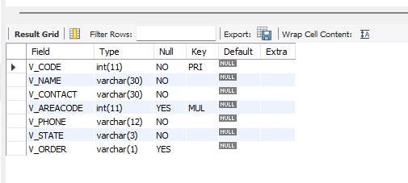
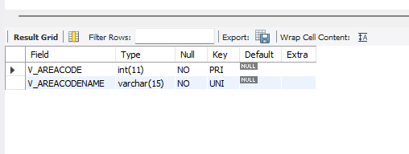

# 🧪 Final Lab Task: SQL Table Relationships, Views, Procedures, and Functions
This project demonstrates relational database operations using MySQL Workbench.
It includes database creation, table setup with constraints, data insertion, creation of views, a stored procedure, and a function with a cursor.

## 💽 Database: inventory

## 🏗️ Database & Tables Creation
```sql
CREATE DATABASE inventory;
USE inventory;
```

## 📦 Table: Products

```sql
CREATE TABLE Products (
    P_CODE VARCHAR(10) PRIMARY KEY,
    P_DESCRIPT VARCHAR(35) NOT NULL,
    P_INDATE DATE NOT NULL,
    P_ONHAND INT NOT NULL,
    P_MIN INT NOT NULL,
    P_PRICE DECIMAL(8,2) NOT NULL,
    P_DISCOUNT DECIMAL(5,2) NOT NULL,
    V_CODE INT
);
```


## 📦 Table: vendors
```sql
CREATE TABLE vendors (
    V_CODE INT PRIMARY KEY,
    V_NAME VARCHAR(30) NOT NULL,
    V_CONTACT VARCHAR(30) NOT NULL,
    V_AREACODE INT, 
    V_PHONE VARCHAR(12) NOT NULL,
    V_STATE VARCHAR(3)  NOT NULL,
    V_ORDER VARCHAR(1)
);
```



## 📦 Table: vendorsACode
```sql
CREATE TABLE vendorsACode (
    V_AREACODE INT PRIMARY KEY,
    V_AREACODENAME VARCHAR(15) NOT NULL
);

```



## 🔗 Constraints & Keys  
### ✅ Primary Keys on all tables
### ✅ Foreign Keys with ON UPDATE CASCADE
### ✅ CHECK Constraint on V_ORDER
### ✅ UNIQUE constraint on area code name

---

## 🧾 Sample Data Insertion
```sql
INSERT INTO vendorsACode VALUES (615, 'AC'), (904, 'SF'), (901, 'MAG');
INSERT INTO vendors VALUES
(21225, 'Bryson,Inc.', 'Smithson', 615, '223-3234', 'TN', 'Y'),
(21226, 'SuperLoo,Inc.', 'Flushing', 904, '215-8995', 'FL', 'N'),
...

```

```sql
INSERT INTO Products VALUES
('111111', 'PAKO', '2002-01-17', 10, 2, 100.00, 0.00, 21227),
('13-Q2/P2', '7.25-in pwr,saw blade', '2002-01-13', 32, 15, 14.99, 0.05, 21344),
...
```
## 🔍 Views
### 📄 view_products_2002_onwards
Shows products with input dates from 2002 and later with vendor details.
```sql
CREATE VIEW view_products_2002_onwards AS
SELECT 
    v.V_CODE AS vendor_code,
    v.V_NAME AS vendor_name,
    p.P_DESCRIPT AS product_description,
    p.P_INDATE
FROM Products p
JOIN vendors v ON p.V_CODE = v.V_CODE
WHERE YEAR(p.P_INDATE) >= 2002;
```


## 📄 view_products_price_range
Displays products priced between 100 and 150.
```sql
CREATE VIEW view_products_price_range AS
SELECT * FROM Products
WHERE P_PRICE BETWEEN 100 AND 150;
```


## 📄 view_total_price_selected_vendors
Shows total price (onhand × price) for selected vendors.
```sql
CREATE VIEW view_total_price_selected_vendors AS
SELECT 
    p.V_CODE,
    v.V_NAME,
    p.P_DESCRIPT,
    (p.P_ONHAND * p.P_PRICE) AS TOTAL_PRICE
FROM Products p
JOIN vendors v ON p.V_CODE = v.V_CODE
WHERE p.V_CODE IN (21344, 23119, 24288);
```


## 🛠️ Stored Procedure
###🔧 update_vendor_name
Updates the vendor name based on the old name provided.
```sql
DELIMITER $$
CREATE PROCEDURE update_vendor_name(IN old_name VARCHAR(50))
BEGIN
    UPDATE vendors
    SET V_NAME = 'Bryson and Co'
    WHERE V_NAME = old_name;
END $$
DELIMITER ;

-- Disable safe updates temporarily
SET SQL_SAFE_UPDATES = 0;
CALL update_vendor_name('Bryson,Inc.');
SET SQL_SAFE_UPDATES = 1;
```

## 🧠 SQL Function
### 📦 get_products_by_vendor
Returns a list of products and prices for a given vendor code and state using a cursor.
```sql
DELIMITER $$
CREATE FUNCTION get_products_by_vendor(vcode INT, vstate VARCHAR(5))
RETURNS TEXT
DETERMINISTIC
BEGIN
    DECLARE result TEXT DEFAULT '';
    DECLARE done INT DEFAULT FALSE;
    DECLARE pdesc VARCHAR(100);
    DECLARE pprice DECIMAL(8,2);
    DECLARE cur CURSOR FOR 
        SELECT p.P_DESCRIPT, p.P_PRICE
        FROM Products p
        JOIN vendors v ON p.V_CODE = v.V_CODE
        WHERE v.V_CODE = vcode AND v.V_STATE = vstate;
        
    DECLARE CONTINUE HANDLER FOR NOT FOUND SET done = TRUE;

    OPEN cur;
    read_loop: LOOP
        FETCH cur INTO pdesc, pprice;
        IF done THEN
            LEAVE read_loop;
        END IF;
        SET result = CONCAT(result, pdesc, ' - ', pprice, ' | ');
    END LOOP;
    CLOSE cur;
    RETURN result;
END $$
DELIMITER ;

SELECT get_products_by_vendor(21344, 'KY');

```
