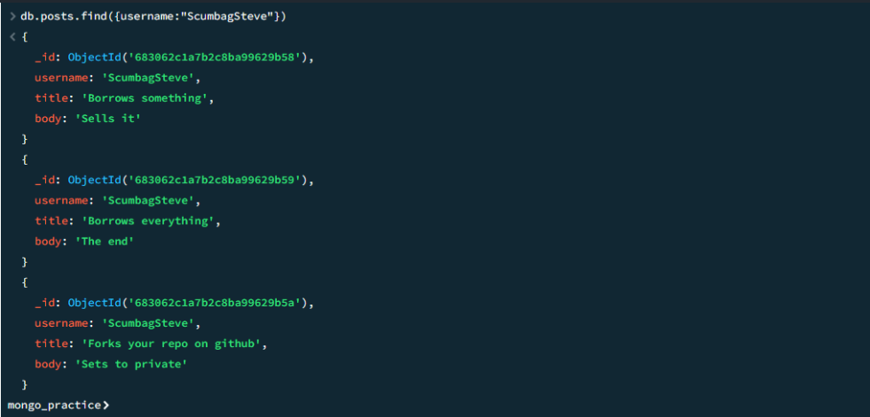

# 🗃️ Final Task 6 - MongoDB
## 📥 1. INSERTS
## 🎬 Insert Movies

```sql
db.movies.insertMany([
  {title: "Fight Club", writer: "Chuck Palahniuk", year: "1999", actors: ["Brad Pitt", "Edward Norton"]},
  {title: "Pulp Fiction", writer: "Quentin Tarantino", year: "2009", actors: ["John Travolta", "Uma Thurman"]},
  {title: "Inglorious Basterds", writer: "Quentin Tarantino", year: "2009", actors: ["Brad Pitt", "Diane Kruger", "Eli Roth"]},
  {title: "The Hobbit: An Unexpected Journey", writer: "J.R.R. Tolkein", year: "2012", franchise: "The Hobbit"},
  {title: "The Hobbit: The Desolation of Smaug", writer: "J.R.R Tolkien", year: "2013", franchise: "The Hobbit"},
  {title: "The Hobbit: The Battle of the Five Armies", writer: "J.R.R Tolkien", year: "2002", franchise: "The Hobbit", synopsis: "Bilbo and Company are forced to engage in a war..."},
  {title: "Pee Wee Herman's Big Adventures"},
  {title: "Avatar"}
]);
```
```sql
👤 Insert Users

db.users.insertMany([
  {_id: 1, username: "GoodGuyGreg", first_name: "Good Guy", last_name: "Greg"},
  {_id: 2, username: "ScumbagSteve", fullname: {first: "Scumbag", last: "Steve"}}
]);
```

Output:


## 🔍 2 - FINDS
2-1. Get All Documents
```sql
db.movies.find()
```
Output:

 

### 2-2. Get Documents (Quentin Tarantino)
```sql
db.movies.find({writer: "Quentin Tarantino"})
```
Output:


### 2-3. Get Documents (Brad Pitt)

```sql
db.movies.find({actors: "Brad Pitt"})
```

Output:


### 2-4. Get Documents (The Hobbit Franchise)
```sql
db.movies.find({franchise: "The Hobbit"})
```

Output:


### 2-5. Get Documents (Movies from 90s)

```sql
db.movies.find({year: {$gt: "1990", $lt: "2000"}})
```
Output:


### 2-6. Get Documents (Before 2000 or After 2010)
```sql
db.movies.find({$or: [{year: {$gt: "2010"}}, {year: {$lt: "2000"}}]})
```
Output:


## ✏️ 3 - UPDATES
3-1. Add Synopsis to "The Hobbit: An Unexpected Journey"

```sql
db.movies.update(
  {_id: ObjectId("5c9f98e5e5c2dfe9b3729bfe")},
  {$set: {synopsis: "A reluctant hobbit, Bilbo Baggins, sets out to the Lonely Mountain with a spirited group of dwarves to reclaim their mountain home - and the gold within it - from the dragon Smaug."}}
)
```

Output:


### 3-2. Add Synopsis to "The Desolation of Smaug"

```sql
db.movies.update(
  {_id: ObjectId("5c9fa42ae5c2dfe9b3729c03")},
  {$set: {synopsis: "The dwarves, along with Bilbo Baggins and Gandalf the Grey, continue their quest to reclaim Erebor, their homeland, from Smaug. Bilbo Baggins is in possession of a mysterious and magical ring."}}
)
```

Output:


### 3-3. Add Actor "Samuel L. Jackson" to "Pulp Fiction"

```sql
db.movies.update(
  {_id: ObjectId("5c9f983ce5c2dfe9b3729bfc")},
  {$push: {actors: "Samuel L. Jackson"}}
)
```

Output:


## 🔎 4 - TEXT SEARCH

4-1. Synopsis Contains "Bilbo"
```sql
db.movies.find({synopsis: {$regex: "Bilbo"}})
```
Output:


### 4-2. Synopsis Contains "Bilbo" and NOT "Gandalf"

```sql
db.movies.find({
  $and: [
    {synopsis: {$regex: "Bilbo"}},
    {synopsis: {$not: /Gandalf/}}
  ]
})
```
Output:


## ❌ 5 - DELETE
5-1. Delete "Pee Wee Herman's Big Adventure"
```sql
db.movies.remove({_id: ObjectId("5c9f992ae5c2dfe9b3729c00")})
```

Output:  


### 5-2. Delete "Avatar"  

```sql
db.movies.remove({_id: ObjectId("5c9f9936e5c2dfe9b3729c01")})  
```  

Output:


### 6-2. Posts Collection
```sql
db.posts.insertMany([
  {username: "GoodGuyGreg", title: "Passes out at Party", body: "Raises your credit score"},
  {username: "GoodGuyGreg", title: "Steals your identity", body: "Raises your credit score"},
  {username: "GoodGuyGreg", title: "Reports a bug in your code", body: "Sends you a pull request"},
  {username: "ScumbagSteve", title: "Borrows something", body: "Sells it"},
  {username: "ScumbagSteve", title: "Borrows everything", body: "The end"},
  {username: "ScumbagSteve", title: "Forks your repo on github", body: "Sets to private"}
]);
```

### 6-3. Comments Collection
```sql
db.comments.insertMany([
  {username: "GoodGuyGreg", comment: "Hope you got a good deal!", post: ObjectId("POST_ID_1")},
  {username: "GoodGuyGreg", comment: "What's mine is yours!", post: ObjectId("POST_ID_2")},
  {username: "GoodGuyGreg", comment: "Don't violate the licensing agreement!", post: ObjectId("POST_ID_3")},
  {username: "ScumbagSteve", comment: "It still isn't clean", post: ObjectId("POST_ID_4")},
  {username: "ScumbagSteve", comment: "Denied your PR cause I found a hack", post: ObjectId("POST_ID_5")}
]);
```

## 📊 7 - QUERY RELATED COLLECTIONS
### 7-1. Find All Users
```sql
db.users.find().pretty()
```
Output:


### 7-2. Find All Posts
```sql
db.posts.find().pretty()
```
Output:


### 7-3. Posts by GoodGuyGreg
```sql
db.posts.find({username: "GoodGuyGreg"})
```
Output:


### 7-4. Posts by ScumbagSteve
```sql
db.posts.find({username: "ScumbagSteve"})
```
Output:



### 7-5. All Comments
```sql
db.comments.find().pretty()
```
Output:


### 7-6. Comments by GoodGuyGreg
```sql
db.comments.find({username: "GoodGuyGreg"})
```
Output:


### 7-7. Comments by ScumbagSteve
```sql
db.comments.find({username: "ScumbagSteve"})
```

Output:

