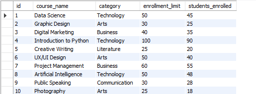
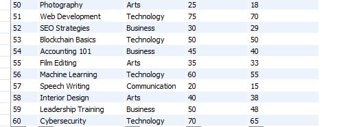

# 📘 Course Database Schema
This project contains a basic relational database design for managing course-related information, including details about course categories, enrollment limits, and the number of students currently enrolled. The database is structured to help track enrollment progress and course popularity.
---
## 🧱 Database: course_db

## 📚 courses
This table stores details about each course, including the course name, category, enrollment limits, and current number of students enrolled.

```sql
CREATE TABLE courses (
    id INT AUTO_INCREMENT PRIMARY KEY,
    course_name VARCHAR(255) NOT NULL,
    category VARCHAR(100) NOT NULL,
    enrollment_limit INT NOT NULL,
    students_enrolled INT NOT NULL
);
```
---
## 🔄 Insert Data
Here’s how the data is inserted into the courses table:  
---

---




---

## 🧾 Queries 
Here are some queries you can run to interact with the database:
List courses with enrollment less than the limit:
---
## TASK 1
List courses with enrollment less than the limit:
```sql
SELECT * FROM courses WHERE students_enrolled < enrollment_limit;
```


## TASK 2
Group courses by category and count total students enrolled:
```sql
SELECT category, SUM(students_enrolled) AS total_students_enrolled FROM courses GROUP BY category;
```


## TASK 3
List courses that have reached the enrollment limit:
```sql
SELECT * FROM courses WHERE students_enrolled = enrollment_limit;
```


## TASK 4
Get the total number of students across all courses:
```sql
SELECT SUM(students_enrolled) AS total_students FROM courses;
```


## TASK 5
List courses in alphabetical order by course name:
```sql
SELECT * FROM courses ORDER BY course_name ASC;
```


