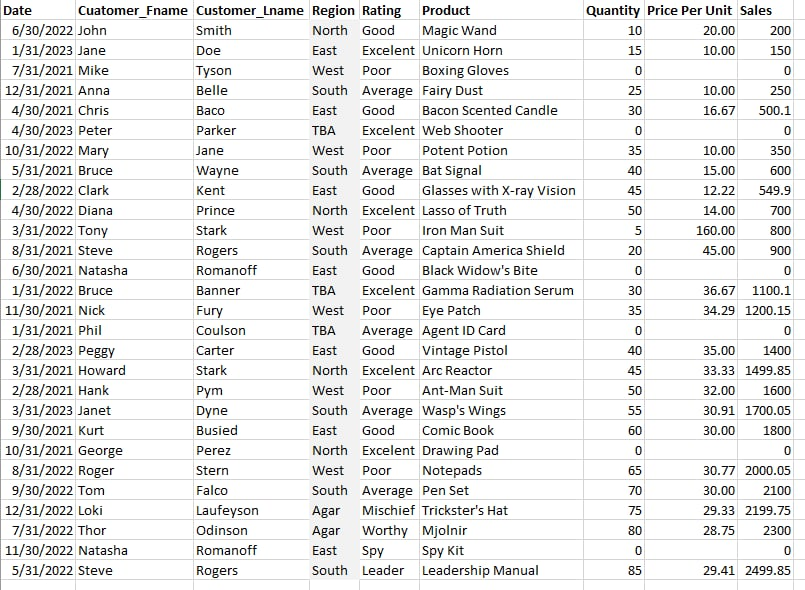

# Midterm Lab Task 1 - Data Cleaning and Preparation using Excel
We are provided with flat data from an Excel file (see raw file) and tasked to perform data cleaning and preparation.
### Step 1: Data Cleaning Process  
- Import the raw file  
- Adjust column and row width and height  
- Remove extra spaces using TRIM function  
- Eliminate NULL values  
- Delete duplicate entries
- ### Step 2: Normalization  
- Applied First Normal Form (1NF)  
- Split tables using Second Normal Form (2NF)  
- Applied Third Normal Form (3NF)  
- Converted normalized tables into a Physical Data Model  
### Step 3: Here's the screenshot of my output before I started data cleaning  
(See screenshot)  

### Step 4: Screenshot of My Output After Data Cleaning

### Here's the Physical Representation of the Data Model

