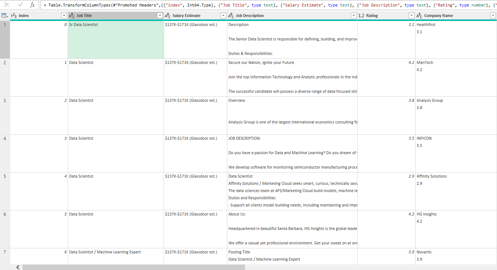
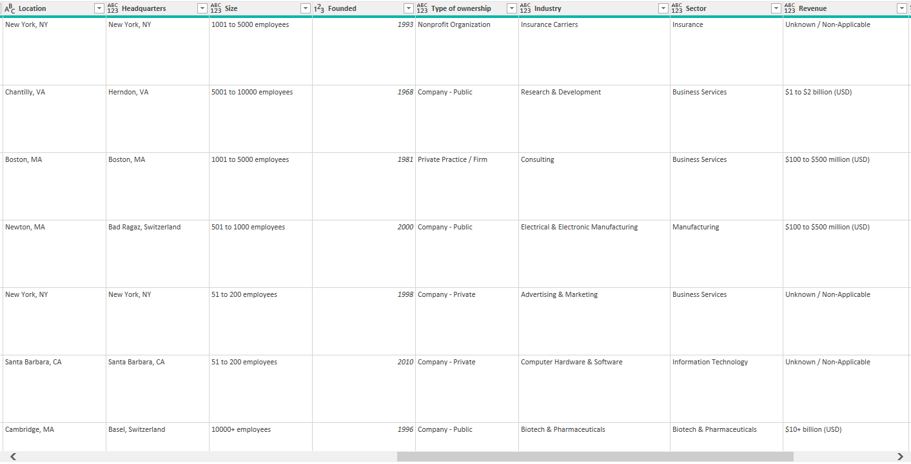
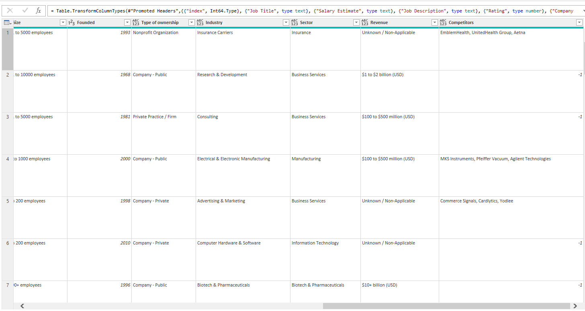
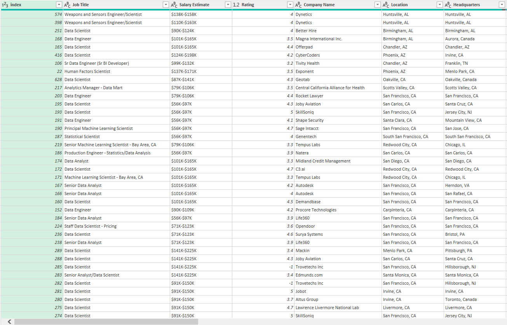
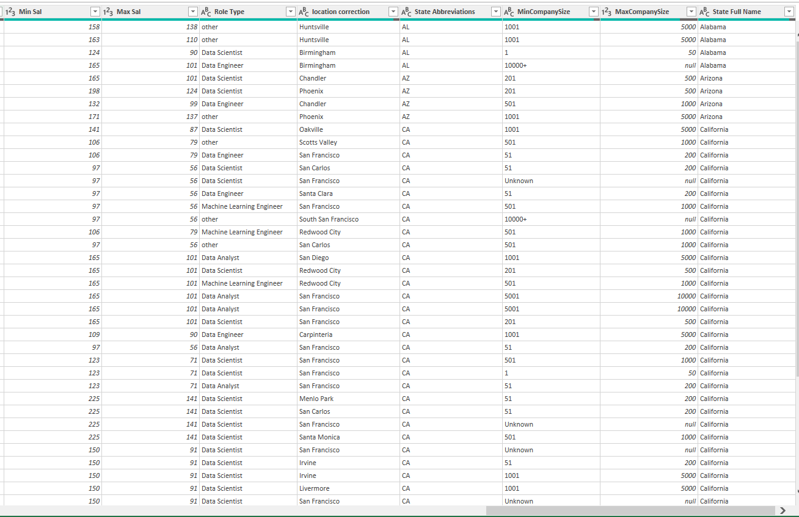
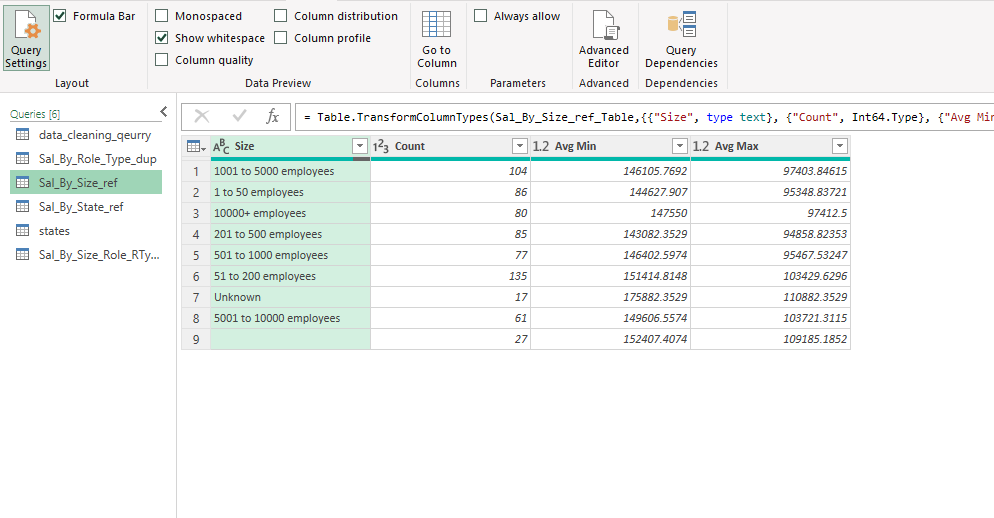
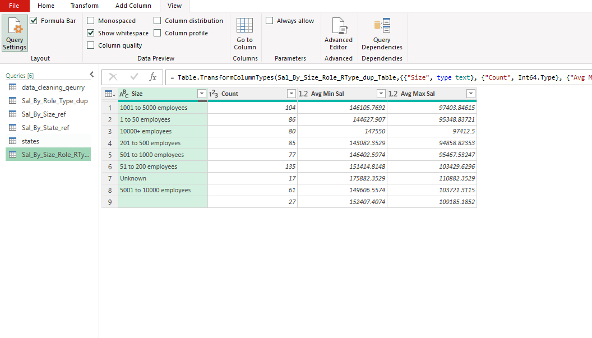
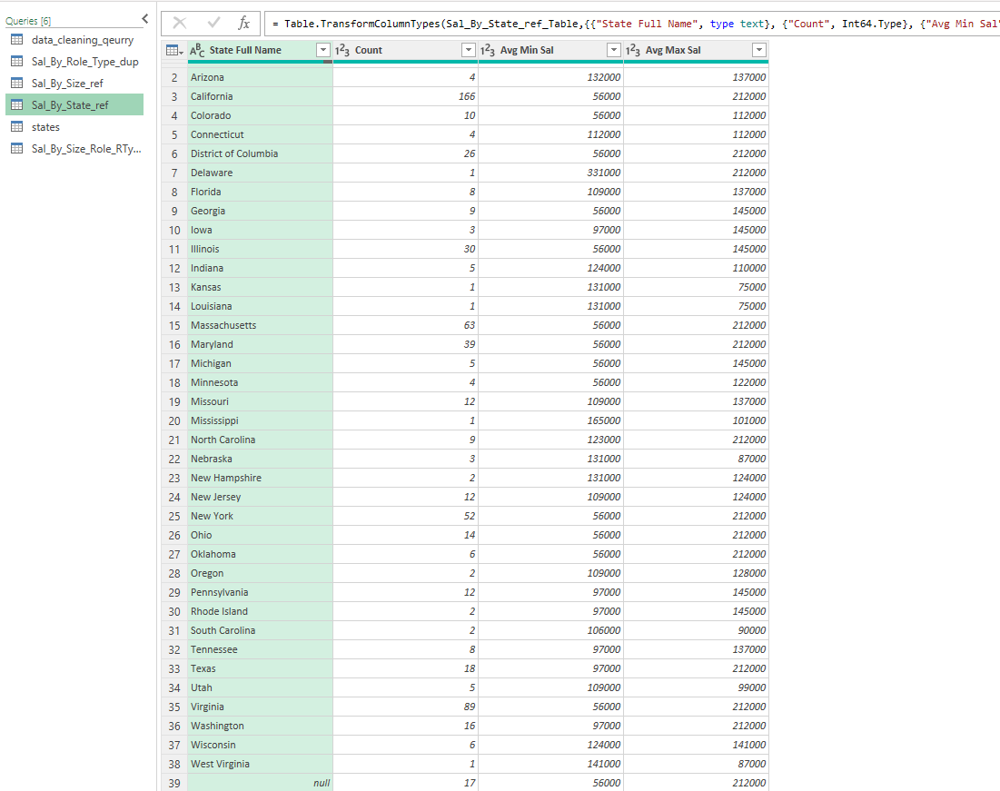

# Midterm Lab Task 2 Project: Data Cleaning and Transformation Using Power Query Editor

## Overview

Company X aims to derive actionable insights from the "UnclenedDSJobs" dataset sourced from Kaggle. The analysis focuses on understanding salary trends across various job roles, company sizes, and geographic locations.

## Objectives

1. **Identify Job Roles with the Highest and Lowest Salaries**
2. **Analyze Salary Trends by Company Size**
3. **Examine Salary Differences by State**

## Data Cleaning and Transformation Tasks

### Part 1: Initial Cleaning

- **Salary Estimate**: Split into **Min Sal** and **Max Sal** columns.
- **Role Type**: Add a column to classify roles (e.g., Full-time, Part-time).
- **Location**: Split into city and state, correct inconsistencies.
- **Size**: Split into minimum and maximum size ranges.
- **Negative Values**: Identify and correct or remove negative values.
- **Company Name**: Remove appended rating info.
- **Remove Unnecessary Columns**: Drop irrelevant columns.

### Part 2: Reshape and Group Data

- **Duplicate and Rename**: Duplicate and rename dataset for role type analysis.
- **Create References**: Create references for company size and state analysis.
- **Mapping External Files**: Integrate additional data if needed.

### Visual References

- *Before Cleaning*: Insert uncleaned dataset screenshot.

  
- *After Cleaning*: Insert cleaned dataset screenshot.
  

If this still doesn't work, try using a relative path like this (assuming the Markdown file is in the root directory of your project):

- *After Cleaning*: Insert cleaned dataset screenshot.

Or, if the Markdown file is inside the Midterm Lab Task 2 folder, adjust it like this:

- *After Cleaning*: Insert cleaned dataset screenshot.

photo

Try these and let me know if the image shows up!

## Dependencies and References

- Insert relevant screenshots.

## Final Output

    
    

 

    
    

### Physical Data Model

- Insert data model screenshot.

## Conclusion

This project cleans and transforms the dataset to reveal insights into salary trends based on roles, company sizes, and locations.

---

## Quick Instructions

1. Open Power Query Editor.
2. Follow the data cleaning and transformation steps.
3. Validate results by comparing with final output screenshots.

**Note**: Replace placeholders with actual images.
